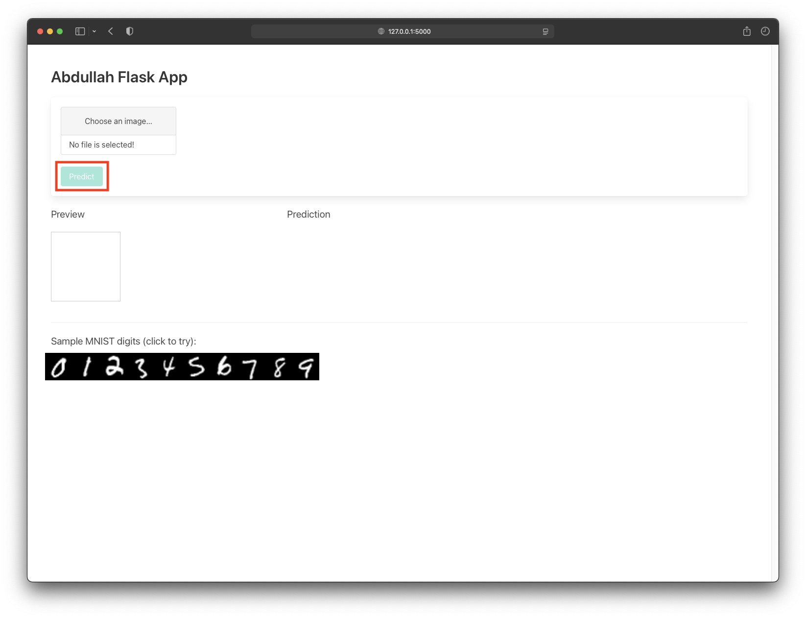
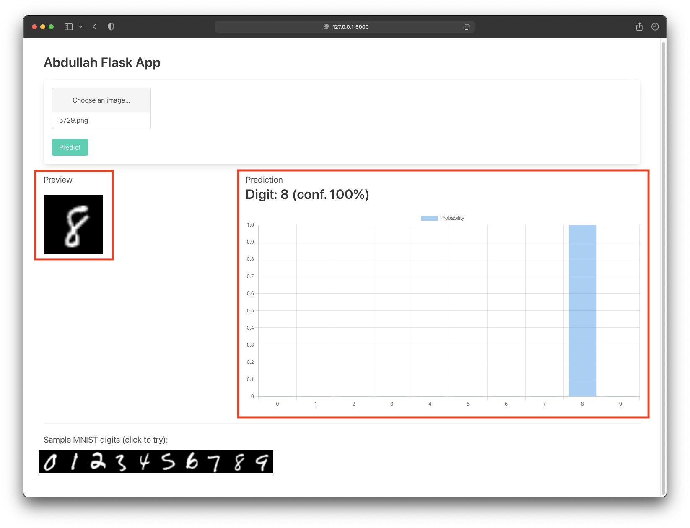
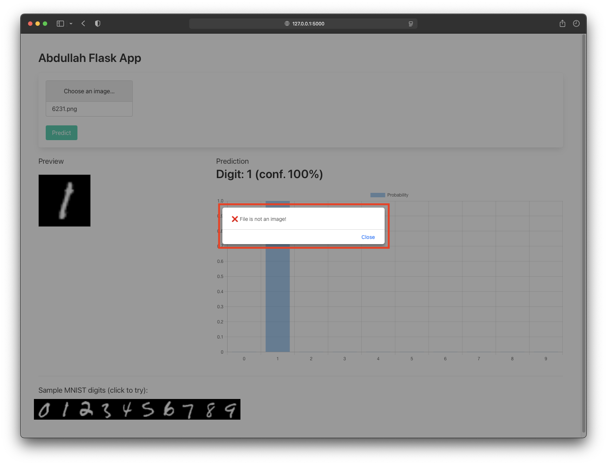

# Deploying Flask based Web Application with pre-trained ONNX model

This repository contains the deployment of ***Convolutional Neural Networks*** for the MNIST dataset. It also includes a Flask-based Web Application that uses a pre-trained model to predict digits (along with their confidence) based on the input provided.

## How to run the Flask App

1. Execute the following instructions as a command-line on the directory containing the web server files.

```!SHELL
$ python3 -m venv abdullahapp
$ source abdullahapp/bin/activate
$ pip3 install -r requirements.txt
$ python3 app.py
```

**Sample console output:**

```=!
/home/abdullah/abdullah_flask_app ❯ python3 app.py                                               abdullahapp  22:18:33
 * Serving Flask app 'app'
 * Debug mode: on
WARNING: This is a development server. Do not use it in a production deployment. Use a production WSGI server instead.
 * Running on http://127.0.0.1:5000
Press CTRL+C to quit
 * Restarting with stat
 * Debugger is active!
 * Debugger PIN: 127-897-454
 ```
 
 2. Access the webserver using `https://127.0.0.1:5000`


**Note**: Use `Ctrl + C` to stop the server.


## Screenshots

|  |
| -------- | 
| <center> Figure 1: Flask Application Web Interface </center> | 

|  |
| -------- | 
| <center> Figure 2: Successful prediction in Flask Application </center> |

|  |
| -------- | 
| <center> Figure 3: An error raised while uploading an invalid image </center> | 


## Thank you!

Feel free to ping me if you have any queries or concerns.

**Cheers**!!
